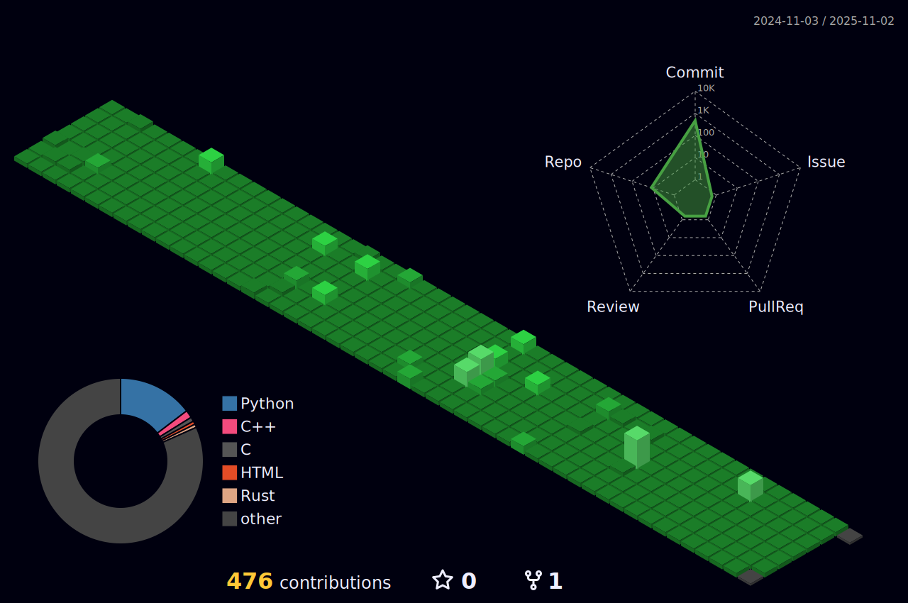

# Hi, I'm Doyeon. :wave:
also known as my nickname, **cyalume**.  
I'm a student, CTF organizer and CTF player.  
I do researches on `Anti-reversing techniques` and `Software Security`.

# Education
- WJGH 72 (2021\~2023)
- KAIST 24, School of Freshman (2024\~2025)
- KAIST 24, School of Computing (2025\~)

# I do
- Reverse Engineering on various Softwares
- Solve wargames
- Participate in CTFs
- Organize CTFs
- Make Challenges for CTFs
- Create things for fun

# I'm interested in...
- Reverse Engineering & Anti-Reversing
- System Hacking (aka Pwn)
- Computer Architecture & Low level language
- Quantum computing & Quantum cryptography
- Stuffs like 3D modeling, electronics, mechanics
- Universal Design

# Projects 👾

  
View my projects!

  
| Project name                                                | Period                       | Members                                      | Organization                                 | Details                                                                                                                                         |
|-------------------------------------------------------------|------------------------------|----------------------------------------------|----------------------------------------------|-------------------------------------------------------------------------------------------------------------------------------------------------|
| [T3N4CI0US CTF 2022](https://ctftime.org/event/1575/)                                          | March, 2022                  |                                              | CYB3R T3N4CI0US                              | made 2 rev challs: [an old book](https://github.com/cy4lume/2022-Basic-CTF-rev/tree/main/an%20old%20book), [BabyEquation](https://github.com/cy4lume/2022-Basic-CTF-rev/tree/main/BabyEquation)                                                                                                    |
| [Visualization of Law of Large Numbers](https://github.com/cy4lume/Probability-and-Statistics)                       | May, 2022                    | cy4lume                                      | Wonju Girls' High School                     | made for Probability & Statistics Class (using Python)                                                                                          |
| [LetsVegan](https://github.com/cy4lume/letsvegan)                                                   | July, 2022                   | cy4lume, Yeseul Choi, Juheui Park, Hyein Lee | Wonju Girls' High School                     | developed a website promoting the vegan movement, for flexible-class schedule week project                                                      |
| [T3N4CI0US CTF - ESCAPE](https://ctftime.org/event/1678/)                                      | August, 2022                 |                                              | CYB3R T3N4CI0US                              | made 2 rev challs: EASY, [TLS](https://github.com/cy4lume/ESCAPE-ctf-2022-T.L.S.)                                                                                                                    |
| PE protector development                                    | August, 2022 - October, 2022 | cy4lume                                      | Wonju Girls' High School                     | R&E Project (using C++, Microsoft inline assembler) Original Title: 역공학 방지 기법을 적용한 Windows Portable Executable 프로텍터의 개발       |
| [Statistics Poster about Bug Bounty](https://github.com/cy4lume/statistics-poster)                          | September, 2022              | cy4lume                                      | Wonju Girls' High School                     | made web-based poster for Probability & Statistics Class                                                                                        |
| Internal CTF for team management                            | November, 2022               |                                              |                                              | made 4 rev challs: Anti, EasyPW, EasySharp, fairy
| [Report: How to hack optical cable](https://cyalume.tistory.com/54)                           | November, 2023               | cy4lume                                      | Wonju Girls' High School                     | authored a report demonstrating the physical feasibility of eavesdropping on fiber optic cables, for the Physics I class                        |                                                                                              |
| [2022 Suspense CTF](https://www.co-worker.co.kr/contest/contest_view?idx=4390)                                           | November, 2022               |                                              | Team Suspense at Yeungnam University College | made 2 rev challs: easy, Master O' Equation                                                                                                     |
| [Christmas CTF](https://ctf.suriryuk.com/)                                               | December, 2022               |                                              | Team Suspense at Yeungnam University College | made 2 rev challs: [Light Up My Christmas!](https://github.com/cy4lume/Christmas-CTF-2022/tree/main/Light%20Up%20My%20Christmas!), [wish](https://github.com/cy4lume/Christmas-CTF-2022/tree/main/wish)                                                                                                 |
| Developing an illegal trafficking detector using CNN        | July, 2023                   | cy4lume, Hyein Jeong, Namgyeong Won          | Wonju Girls' High School                     | developed device that detects gun sound and report to the nearest local government, for flexible-class schedule week project                    |
| [ESCAPE CTF 2023 Preliminary](https://ctftime.org/event/2022)                                 | August, 2023                 |                                              | CYB3R T3N4CI0US                              | made 2 rev cahlls: Smartest Captive, KeyCheck                                                                                                   |
| [Report: Implementation and Vulnerabilities of QKD Algorithm](https://cyalume.tistory.com/58) | August, 2023                 | cy4lume                                      |                                              | implemented the BB84 Protocol in C & Python, wrote a report on potential vulnerabilities arising during the implementation of this QKD protocol |
| [ESCAPE CTF 2023 Final](https://ctftime.org/event/2213/)                                       | February, 2024               |                                              | CYB3R T3N4CI0US                              | made 3 rev challs: rev1, rev2, rev4                                                                                                             |

# Here's my github history

# contacts

 

 

